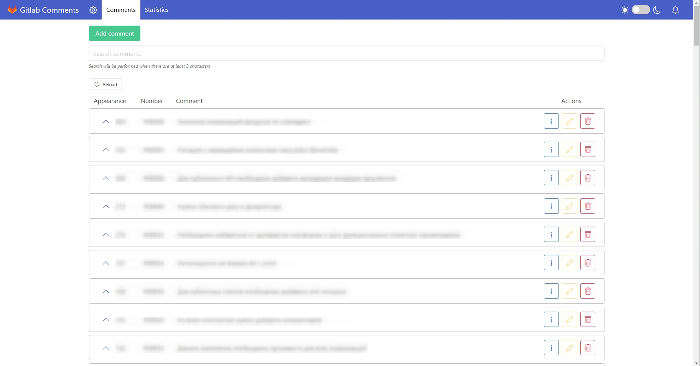

# MAS.GitlabComments.Client

The application is the frontend part of the GitlabComments application.

## Usage

### Installation

Installation is only possible on a deployed [web application (webAPI)](https://github.com/bodynar/MAS.GitlabComments.Api).
The version of the client application should not exceed the maximum supported version of the web application.

### Usage

The application can be used as the UI component of a web application, i.e., a website.



### Configuration

The application supports configuration by editing the `app.settings.json` file.

## Development

For development, the following libraries must be installed:
- node
- npm (included with node)

On the first run, you need to download the dependencies using `npm ci`.
To start the application, use the command `npm run dev`.

For development, it is recommended to use:
- The develop version of the web service.
- Proxy configuration in the `vite.config.ts` file.

For example:
```ts
export default defineConfig({
	plugins: [
		splitVendorChunkPlugin(),
		react(),
		tsconfigPaths(),
		eslintPlugin(),
	],
	build: {
		sourcemap: true,
	},
    server: {
        proxy: {
            "/api": {
                target: "https://localhost:443/api/",
                changeOrigin: true,
                rewrite: (path) => path.replace(/^\/api/, ""),
                secure: false,
            },
        }
    }
});